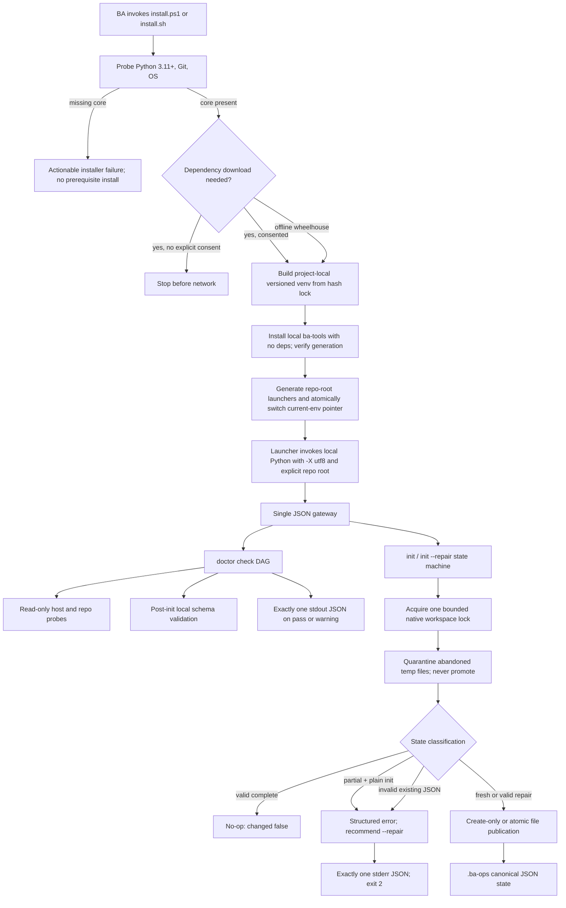

# Phase BAOPS-01: Harness Foundation - Research

**Researched:** 2026-07-21  
**Domain:** Cross-platform Python CLI bootstrap, deterministic JSON I/O, safe local file-state  
**Confidence:** MEDIUM

<user_constraints>
## User Constraints (from CONTEXT.md)

### Locked Decisions

#### Phase Boundary

Deliver a portable, local-first foundation that lets a BA bootstrap and validate a project workspace on Windows or POSIX: a project-local `ba-tools` installation, repo-root launchers, `doctor`, safe `init`/repair behavior, the initial `.ba-ops/` files, path containment, UTF-8 JSON I/O, and crash-safe writes.

REQ-ID registries, SRS authoring, workflow execution, artifact generation, trace/INDEX semantics, plugins, and team mode remain in later phases.

#### Installer and invocation
- **D-01:** Install `ba-tools` into an isolated, project-local environment. Do not install it per-user or system-wide.
- **D-02:** Generate repo-root launchers: `.\ba-tools.ps1` on Windows and `./ba-tools` on POSIX. They must work without activating a virtual environment and without modifying user or system `PATH`.
- **D-03:** Treat the roadmap phrase “working `ba-tools` on PATH” as “directly runnable from the repo-root launcher.” This intentionally rejects persistent `PATH` modification and must be reflected in planning and acceptance tests.
- **D-04:** Do not automatically install missing system prerequisites such as Python or Git. Fail early with actionable, OS-specific guidance.
- **D-05:** Once a compatible Python exists, the installer may download locked project dependencies only after explicit user consent.
- **D-06:** Pin the exact `ba-tools` version and dependencies per repository. Re-running the installer synchronizes to the lockfile; upgrades are explicit rather than automatic.

#### Doctor policy
- **D-07:** Missing core requirements produce overall `fail` and exit code 2. Missing dependencies for plugins that are not enabled produce `warning` and exit code 0.
- **D-08:** Default `doctor` scope is core plus the current profile and enabled plugins. `doctor --all` checks every known optional dependency.
- **D-09:** `doctor` works before and after initialization. Pre-init checks the host and repository; post-init additionally validates config, policy, and durable file-state.
- **D-10:** Continue running independent checks after a failure. Mark checks whose prerequisites failed as `skipped`, then return all actionable findings in one result.

#### Init and re-init safety
- **D-11:** Re-running `init` against a valid `.ba-ops/` is an idempotent success with `changed: false`; it must not rewrite files.
- **D-12:** Plain `init` fails safely when required files are missing and recommends explicit `init --repair`.
- **D-13:** `init --repair` may create missing required files only. It must never replace an existing file.
- **D-14:** If an existing JSON file is invalid or violates its schema, preserve it and fail with precise validation errors. Do not reset or back it up automatically.
- **D-15:** Initialize minimal, valid state without business inference or sample data: `profile: light`, the standard light coverage policy, and a valid empty `business-goals.json`.

#### Locking and crash recovery
- **D-16:** A writer waits for a bounded interval when another process holds a valid lock, then returns a structured timeout error with retry guidance. Never wait indefinitely.
- **D-17:** Automatically recover a stale lock only when staleness can be established safely, including that the owner process is no longer active. Ambiguous cases fail without removing the lock.
- **D-18:** If a crash leaves an atomic-write temporary file, keep the canonical file unchanged and quarantine the temporary file for inspection. Never auto-promote it.
- **D-19:** Use one workspace-wide write lock for `.ba-ops/` mutations in v1. Pilot scale does not justify concurrent writers or multi-lock complexity.

### Claude's Discretion

No discussed decision was delegated. The planner may choose unconstrained implementation details such as the exact bounded timeout, JSON field names, lock metadata format, quarantine naming, and environment tooling, provided all behavior above remains true.

### Deferred Ideas (OUT OF SCOPE)

None — discussion stayed within phase scope.
</user_constraints>

<phase_requirements>
## Phase Requirements

| ID | Description | Research Support |
|----|-------------|------------------|
| FOUND-01 | `ba-tools` CLI returns exactly one UTF-8 JSON object on stdout for success; errors use stderr and exit 2. | Central JSON gateway, disabled framework output, byte-level subprocess contract tests. `[VERIFIED: .planning/REQUIREMENTS.md]` |
| FOUND-02 | `ba-tools doctor` checks Python, UTF-8, repo layout, and optional dependencies. | Dependency-aware check DAG with `pass`, `warning`, `fail`, and `skipped`; pre/post-init modes. `[VERIFIED: .planning/REQUIREMENTS.md]` |
| FOUND-03 | One-command Windows PowerShell and POSIX installers contain no machine-specific paths. | Thin shell wrappers over one Python bootstrap, script-root discovery, project-local versioned environments, generated launchers. `[VERIFIED: .planning/REQUIREMENTS.md; 01-CONTEXT.md D-01..D-06]` |
| FOUND-04 | `init` creates `config.json`, `coverage-policy.json`, and `business-goals.json` under `.ba-ops/`. | Explicit init state machine, local JSON Schemas, create-only publication, idempotency and repair tests. `[VERIFIED: .planning/REQUIREMENTS.md; 01-CONTEXT.md D-11..D-15]` |
| FOUND-05 | Every business path is repo-relative and traversal-safe. | Canonical POSIX path representation, resolved-root containment, symlink/reparse-point checks, table-driven adversarial tests. `[VERIFIED: .planning/REQUIREMENTS.md; docs/BRD-v1.0.md NFR-009]` |
| FOUND-06 | Writes use locking and atomic replacement; crashes cannot leave partial canonical files. | One native workspace lock, bounded timeout, owner metadata, same-directory temp files, `fsync`, replace/create-only publication, quarantine. `[VERIFIED: .planning/REQUIREMENTS.md; 01-CONTEXT.md D-16..D-19]` |
| NFR-02 | Core supports Windows 10+, macOS 12+, Linux, and Python 3.11+. | Python `>=3.11`, OS-neutral stdlib primitives, PowerShell/POSIX wrappers, Python/OS test matrix plus minimum-OS smoke gap. `[VERIFIED: .planning/REQUIREMENTS.md]` |
| NFR-03 | Core `ba-tools` performs no HTTP, DNS, telemetry, or LLM calls. | Hard installer/runtime boundary, import/static guard, socket-denial tests, local subprocess allowlist. `[VERIFIED: .planning/REQUIREMENTS.md; docs/BRD-v1.0.md NFR-009]` |
| NFR-04 | Artifacts and CLI output preserve full Vietnamese UTF-8. | Launcher `-X utf8`, explicit UTF-8 bytes, `ensure_ascii=False`, Unicode root/fixture tests on every OS. `[VERIFIED: .planning/REQUIREMENTS.md; local UTF-8 probe]` |
| NFR-05 | CLI does not infer business meaning. | Commands return mechanical facts only; defaults are fixed product policy, with no sample goals or inferred content. `[VERIFIED: .planning/REQUIREMENTS.md; docs/BRD-v1.0.md NFR-006]` |
</phase_requirements>

## Summary

This repository is greenfield: it contains product/planning documents but no Python package, installer, launchers, schemas, tests, rules, or project skills. Phase 1 therefore has to establish both the implementation seams and their tests; there is no legacy code to preserve. `[VERIFIED: repository scan; 01-CONTEXT.md Existing Code Insights]`

Build a small Python 3.11+ package around one non-bypassable JSON process boundary, then keep command handlers pure: they return data or raise typed `BaToolsError` values and never print. Use direct Click invocation with `standalone_mode=False`, local JSON Schemas, one native `filelock` lock, and stdlib path/temp/replace primitives. Use shell wrappers only to locate a compatible Python and call a shared Python installer; the installed CLI itself remains permanently zero-network. `[CITED: https://click.palletsprojects.com/en/stable/exceptions/]` `[CITED: https://py-filelock.readthedocs.io/en/latest/]` `[CITED: https://docs.python.org/3.11/library/pathlib.html#pathlib.Path.resolve]` `[VERIFIED: 01-CONTEXT.md D-01..D-19]`

The highest-risk work is not command parsing; it is preserving the exact stream contract on every path, handling Windows redirected output where the current host defaults to `cp1252`, distinguishing an inert persistent lock file from a held native lock, preventing repair from replacing existing bytes, and proving containment across `..`, symlinks, junctions, drive-relative paths, UNC paths, and paths with spaces. These need subprocess, multiprocessing, and fault-injection tests in Wave 0 rather than end-of-phase manual checks. `[VERIFIED: local probe showed UTF-8 mode 0 and cp1252 standard streams; docs/BRD-v1.0.md R-5; 01-CONTEXT.md D-13..D-18]`

**Primary recommendation:** implement Phase 1 as three vertical slices—CLI contract/path core, durable state primitives plus `init`, then installer/`doctor`—with contract tests added before each slice and a final cross-platform installer smoke gate. `[VERIFIED: requirement dependency analysis]`

## Architectural Responsibility Map

| Capability | Primary Tier | Secondary Tier | Rationale |
|------------|--------------|----------------|-----------|
| Prerequisite discovery and consent | Host installer | OS/package manager | Runs before `ba-tools` exists; only this boundary may perform consented dependency download. `[VERIFIED: 01-CONTEXT.md D-04..D-05]` |
| Repo-root launchers | Host shell | CLI process | Resolve their own directory and invoke the selected project-local interpreter without PATH mutation. `[VERIFIED: 01-CONTEXT.md D-02..D-03]` |
| Strict JSON/exit-code contract | CLI entry boundary | Command handlers | The outermost process layer must own both streams and map all expected failures to exit 2. `[VERIFIED: FOUND-01; docs/BRD-v1.0.md BRD-022]` |
| `doctor` orchestration | CLI application | OS/process probes | Aggregates mechanical checks while local probes inspect Python, Git, encodings, and optional executables. `[VERIFIED: FOUND-02; 01-CONTEXT.md D-07..D-10]` |
| `init`/repair state machine | CLI application | Filesystem state | Classification and schema validation happen before any mutation; storage only executes the selected safe transition. `[VERIFIED: 01-CONTEXT.md D-11..D-15]` |
| Path containment | Filesystem boundary | CLI validation | Every file operation receives an already-contained path capability, not an unchecked string. `[VERIFIED: FOUND-05; docs/BRD-v1.0.md NFR-009]` |
| Locking, atomic write, quarantine | Filesystem boundary | OS kernel | Native file locks serialize writers; same-filesystem publication preserves canonical bytes. `[CITED: https://py-filelock.readthedocs.io/en/latest/concepts.html]` `[CITED: https://docs.python.org/3.11/library/os.html#os.replace]` |
| JSON schemas and defaults | Package resources | Filesystem state | Shipped, versioned resources validate locally with no network or hidden inference. `[VERIFIED: docs/BRD-v1.0.md BRD-021/BRD-028]` |
| UTF-8 enforcement | Process boundary | Filesystem serialization | Startup mode controls streams/filesystem; serializers explicitly preserve non-ASCII bytes. `[CITED: https://docs.python.org/3.11/library/os.html#python-utf-8-mode]` |
| Zero-network policy | CLI package boundary | Installer exception boundary | Runtime modules may not import/use network clients; only the separately located installer can invoke consented pip operations. `[VERIFIED: NFR-03; docs/BRD-v1.0.md NFR-009]` |

## Project Constraints (from `.cursor/rules/`)

No `.cursor/rules/`, `.claude/.cursor/rules/`, `.cursor/skills/`, or `.agents/skills/` files exist. The generated `.claude/CLAUDE.md` requires work to proceed through GSD; this research is running inside `/gsd-plan-phase`. No code conventions are established yet. `[VERIFIED: repository scan; .claude/CLAUDE.md]`

Nyquist validation and security enforcement are enabled, at ASVS level 1; therefore the plan must create test infrastructure and security verification tasks rather than defer them. `[VERIFIED: .planning/config.json]`

## Standard Stack

### Core

| Library / facility | Version | Purpose | Why Standard |
|--------------------|---------|---------|--------------|
| Python | `>=3.11` | Runtime, `venv`, JSON, paths, subprocesses, temp files, `fsync`, replace/link | Product floor; all target primitives are cross-platform in the stdlib. Local implementation host is Python 3.13.5. `[VERIFIED: docs/BRD-v1.0.md NFR-003; local probe]` |
| `click` `[WARNING: flagged as suspicious — verify before using.]` | `8.4.2` (published 2026-06-24) | Subcommands and typed option parsing | Direct Click exposes `standalone_mode=False`, so the application—not Click—owns exception and stream serialization. `[CITED: https://click.palletsprojects.com/en/stable/exceptions/]` `[CITED: https://pypi.org/project/click/8.4.2/]` |
| `jsonschema` `[WARNING: flagged as suspicious — verify before using.]` | `4.26.0` (published 2026-01-07) | Validate the three durable JSON files against bundled schemas | Explicit validators, `check_schema`, and `iter_errors` provide complete deterministic structural diagnostics without hand-written validators. `[CITED: https://python-jsonschema.readthedocs.io/en/stable/validate/]` `[CITED: https://pypi.org/project/jsonschema/4.26.0/]` |
| `filelock` `[WARNING: flagged as suspicious — verify before using.]` | `3.29.6` (published 2026-07-06; floor `>=3.20.3`) | One cross-platform workspace writer lock | Native `FileLock` uses kernel locking on supported Windows/Unix hosts, supports bounded timeout, and releases ownership on process exit; the security floor includes symlink-race fixes. `[CITED: https://py-filelock.readthedocs.io/en/latest/]` `[CITED: https://github.com/tox-dev/filelock/pull/461]` `[CITED: https://pypi.org/project/filelock/3.29.6/]` |
| stdlib `json`, `pathlib`, `tempfile`, `os`, `subprocess`, `hashlib`, `importlib.resources` | Python 3.11+ | Canonical bytes, containment, atomic files, local process probes, packaged resources | Avoids extra runtime dependencies and maps directly to the locked portability/zero-network boundary. `[CITED: https://docs.python.org/3.11/library/json.html]` `[CITED: https://docs.python.org/3.11/library/pathlib.html]` |

### Supporting

| Library | Version | Purpose | When to Use |
|---------|---------|---------|-------------|
| `hatchling` `[WARNING: flagged as suspicious — verify before using.]` | `1.29.0` (published 2026-02-23) | PEP 517 build backend for a `src/` package | Build/install the local package with an exact backend pin and `--no-build-isolation`. `[CITED: https://hatch.pypa.io/latest/config/build/]` `[CITED: https://pypi.org/project/hatchling/1.29.0/]` |
| `pytest` `[WARNING: flagged as suspicious — verify before using.]` | `9.1.1` (published 2026-06-19) | Unit, subprocess, multiprocessing, and fault-injection tests | Required from Wave 0; `capfdbinary`/subprocess assertions cover byte-level streams. `[CITED: https://docs.pytest.org/en/stable/]` `[CITED: https://pypi.org/project/pytest/9.1.1/]` |
| `ruff` `[WARNING: flagged as suspicious — verify before using.]` | `0.15.22` (published 2026-07-16) | Lint and format | Use for the package and installer-side Python; keep network-policy checks as dedicated tests, not custom Ruff claims. `[CITED: https://docs.astral.sh/ruff/]` `[CITED: https://pypi.org/project/ruff/0.15.22/]` |

### Alternatives Considered

| Instead of | Could Use | Tradeoff |
|------------|-----------|----------|
| Direct Click | Typer | Existing project research recommends Typer, but direct Click removes one abstraction around the locked help/error/output behavior and one direct dependency. Use Click for this phase. `[VERIFIED: .planning/research/STACK.md]` |
| Direct Click | stdlib `argparse` | Avoids one package but requires custom parser error/help behavior; viable only if the package checkpoint rejects Click. `[CITED: https://click.palletsprojects.com/en/stable/exceptions/]` |
| `venv` + hash-locked pip | Require `uv` on BA machines | `uv` is useful in development but is not a locked system prerequisite; requiring it would add bootstrap work before the one-command installer. Use stdlib `venv` in shipped installers. `[VERIFIED: 01-CONTEXT.md D-04; local uv availability is not portable]` |
| Native `FileLock` | `SoftFileLock` | Soft marker locks need stale-owner protocol and can leave claims after crashes; all supported operating systems provide native backends. Use native `FileLock` and fail if it falls back. `[CITED: https://py-filelock.readthedocs.io/en/latest/concepts.html]` |
| JSON Schema | Pydantic-only durable models | Durable files already have independent schema/version contracts; generated Python models must not become a second authority. Use bundled JSON Schema. `[VERIFIED: docs/BRD-v1.0.md §15.1]` |

**Installation (inside the consented installer, not a BA manual step):**

```bash
python -m pip install \
  --require-hashes \
  --only-binary=:all: \
  -r ba-tools/requirements.lock
python -m pip install \
  --no-deps \
  --no-build-isolation \
  ./ba-tools
```

Every direct and transitive requirement must be exact-pinned and SHA-256 hashed; the local project install uses `--no-deps` so it cannot pull undeclared dependencies. An offline path uses `--no-index --find-links <approved-wheelhouse>` with the same lock. `[CITED: https://pip.pypa.io/en/stable/topics/secure-installs/]` `[CITED: https://pip.pypa.io/en/stable/topics/repeatable-installs/]`

**Version verification:** PyPI registry probes on 2026-07-21 confirmed the listed exact versions and publish dates; latest releases observed were Click 8.4.2, filelock 3.31.1, jsonschema 4.26.0, pytest 9.1.1, Hatchling 1.31.0, and Ruff 0.15.22. The plan should keep the selected exact pins above until the required package checkpoint approves changes. `[CITED: https://pypi.org/]`

## Package Legitimacy Audit

The required legitimacy seam returned `SUS` for every direct package because download counts were unavailable, and additionally marked several latest releases as too new. These are established projects with official documentation and source repositories, but the protocol still requires a human-verification checkpoint before installation. `[VERIFIED: gsd-tools package-legitimacy check, 2026-07-21]`

| Package | Registry | Project age | Downloads | Source Repo | Verdict | Disposition |
|---------|----------|-------------|-----------|-------------|---------|-------------|
| `click` | PyPI | ~12 years | unavailable to seam | `github.com/pallets/click` | SUS: too-new latest, unknown downloads | Flagged — planner adds `checkpoint:human-verify`. `[VERIFIED: package-legitimacy seam]` |
| `filelock` | PyPI | ~12 years | unavailable to seam | `github.com/tox-dev/py-filelock` | SUS: too-new latest, unknown downloads | Flagged — planner verifies selected 3.29.6 and security floor. `[VERIFIED: package-legitimacy seam]` |
| `jsonschema` | PyPI | ~14 years | unavailable to seam | `github.com/python-jsonschema/jsonschema` | SUS: unknown downloads | Flagged — planner adds `checkpoint:human-verify`. `[VERIFIED: package-legitimacy seam]` |
| `pytest` | PyPI | ~15 years | unavailable to seam | `github.com/pytest-dev/pytest` | SUS: unknown downloads | Flagged — planner adds `checkpoint:human-verify`. `[VERIFIED: package-legitimacy seam]` |
| `hatchling` | PyPI | ~4 years | unavailable to seam | `github.com/pypa/hatch/tree/master/backend` | SUS: too-new latest, unknown downloads | Flagged — planner verifies selected 1.29.0. `[VERIFIED: package-legitimacy seam]` |
| `ruff` | PyPI | ~4 years | unavailable to seam | `github.com/astral-sh/ruff` | SUS: too-new latest, unknown downloads | Flagged — planner adds `checkpoint:human-verify`. `[VERIFIED: package-legitimacy seam]` |

**Packages removed due to `SLOP` verdict:** none. `[VERIFIED: package-legitimacy seam]`  
**Packages flagged as suspicious `SUS`:** `click`, `filelock`, `jsonschema`, `pytest`, `hatchling`, `ruff`; one human checkpoint may verify the batch, but it must occur before dependency installation. `[VERIFIED: package-legitimacy seam]`

The resolved transitive lock is not available yet because no package manifest exists. The plan must rerun the legitimacy gate over every resolved transitive name before committing `requirements.lock`; registry hashes alone are not sufficient provenance. `[VERIFIED: repository scan]`

## Architecture Patterns

### System Architecture Diagram



The only network-capable branch is the consented installer. Once the launcher enters `ba_tools`, all operations are local file/process/schema checks. `[VERIFIED: 01-CONTEXT.md D-05; NFR-03]`

### Recommended Project Structure

```text
.
├── install.ps1
├── install.sh
├── installer/
│   ├── bootstrap.py
│   └── launcher-templates/
│       ├── ba-tools
│       └── ba-tools.ps1
├── ba-tools/
│   ├── pyproject.toml
│   ├── requirements.lock
│   ├── requirements-dev.lock
│   ├── src/ba_tools/
│   │   ├── __init__.py
│   │   ├── __main__.py
│   │   ├── cli.py
│   │   ├── contracts.py
│   │   ├── errors.py
│   │   ├── doctor.py
│   │   ├── init_command.py
│   │   ├── paths.py
│   │   └── state/
│   │       ├── atomic.py
│   │       ├── locking.py
│   │       ├── validation.py
│   │       └── resources/
│   │           ├── defaults/
│   │           └── schemas/
│   └── tests/
│       ├── unit/
│       ├── contract/
│       ├── integration/
│       ├── reliability/
│       ├── security/
│       └── portability/
├── .github/workflows/
│   └── foundation.yml
├── .gitignore
└── .gitattributes
```

Runtime state belongs in gitignored `.ba-tools-runtime/`; durable business state belongs in `.ba-ops/`. The two must never share a virtual environment, lock pointer, or machine-local executable path. `[VERIFIED: 01-CONTEXT.md D-01; docs/BRD-v1.0.md BRD-021/NFR-004]`

### Component Responsibilities

| Component | Owns | Must not own |
|-----------|------|--------------|
| `install.ps1` / `install.sh` | Script-root and Python/Git discovery, OS-specific remediation, delegation | Dependency resolution logic duplicated per shell; user/system PATH changes. `[VERIFIED: D-02..D-04]` |
| `installer/bootstrap.py` | Consent, hash-locked environment generation, local package install, verification, pointer/launcher switch | Runtime command behavior or business-state mutation. `[VERIFIED: D-05..D-06]` |
| `cli.py` / `contracts.py` | Argument dispatch, help-as-JSON, exactly one emission, exception-to-exit mapping | Direct file writes or command-specific prints. `[VERIFIED: FOUND-01]` |
| `paths.py` | Effective repo root, canonical relative path parsing, containment and reparse guards | CWD-based implicit business paths. `[VERIFIED: FOUND-05]` |
| `doctor.py` | Ordered check definitions, dependency graph, aggregate severity/remediation | Short-circuiting independent checks or installing anything. `[VERIFIED: D-07..D-10]` |
| `init_command.py` | Preflight classification and allowed transition selection | Replacing or “fixing” existing invalid JSON. `[VERIFIED: D-11..D-15]` |
| `state/locking.py` | One bounded native lock, owner sidecar lifecycle, stale/ambiguous decision | Age-only lock breaking or multiple resource locks. `[VERIFIED: D-16..D-19]` |
| `state/atomic.py` | Temp creation, canonical bytes, `fsync`, create-only/replace publication, quarantine | Schema decisions or auto-promoting abandoned temps. `[VERIFIED: D-18]` |
| `state/validation.py` | Load bundled schemas, reject unsupported versions, stable error ordering | Remote `$ref` retrieval or inferred defaults. `[VERIFIED: NFR-03/NFR-05]` |

### Pattern 1: One JSON Gateway, Data-Returning Commands

**What:** Invoke Click with `standalone_mode=False`; command functions return dictionaries and never call `print`, `click.echo`, or logging handlers. One outer `main()` serializes once to stdout on success or once to stderr on every error. Disable Click's automatic help option and return help text inside the normal success envelope. `[CITED: https://click.palletsprojects.com/en/stable/exceptions/]`

**When to use:** Every command, including no-args help, `--help`, `--version`, invalid options, unknown commands, `doctor` failure, and unexpected exceptions. `[VERIFIED: FOUND-01]`

**Contract recommendation:**

```json
{"schema_version":1,"ok":true,"command":"init","data":{"changed":false},"warnings":[]}
```

```json
{"schema_version":1,"ok":false,"command":"init","error":{"code":"STATE_SCHEMA_INVALID","message":"Existing state is invalid and was preserved.","details":[],"remediation":["Correct the reported fields, then retry."]}}
```

Keys, lists, and diagnostics should have stable ordering; canonical serialization uses UTF-8, `ensure_ascii=False`, `allow_nan=False`, compact separators, and one trailing LF. `[CITED: https://docs.python.org/3.11/library/json.html#basic-usage]`

### Pattern 2: Effective Repo Root and Path Capabilities

**What:** The generated launcher supplies its own directory as the effective repo root; direct module invocation requires `--repo-root`. Committed business paths are canonical POSIX-relative strings: reject absolute paths, drive/UNC forms, backslashes, NUL, and any `..` segment before joining. Resolve the root and candidate, verify `candidate.relative_to(root)`, and reject symlink/reparse components for write targets. `[CITED: https://docs.python.org/3.11/library/pathlib.html#pathlib.Path.resolve]` `[CITED: https://owasp.org/www-community/attacks/Path_Traversal]`

**When to use:** Before every read, existence check, schema load target, temp/quarantine destination, or write. Internal APIs should accept a validated path object rather than raw user strings. `[VERIFIED: FOUND-05]`

**Important distinction:** `PurePath.is_relative_to()` is lexical and does not resolve `..` or symlinks; it is insufficient by itself. `[CITED: https://docs.python.org/3.11/library/pathlib.html#pathlib.PurePath.is_relative_to]`

### Pattern 3: Explicit Init State Machine

**What:** Under the workspace lock, classify all required files before writing: `(absent directory) → fresh`, `(all present and valid) → no-op`, `(some missing) → partial`, `(any existing invalid) → invalid`. Plain `init` writes only in `fresh`; `init --repair` writes only missing files in `partial`; both fail with zero writes in `invalid`. `[VERIFIED: D-11..D-15]`

**When to use:** Both `init` routes and post-init doctor validation. Preflight all existing files before repair so one invalid file prevents creation of other missing files in that run. `[VERIFIED: D-13..D-14]`

**Recommended minimal defaults:**

```json
{"profile":"light","schema_version":1}
```

```json
{"per_req":{},"profile":"light","required_artifact_kinds":["srs","flow","mockup"],"schema_version":1,"waivers":[]}
```

```json
{"business_goals":[],"schema_version":1}
```

The empty goals registry follows D-15 even though the BRD documents later goal mappings; Phase 1 must not infer or seed business content. `[VERIFIED: D-15; docs/BRD-v1.0.md §4.3]`

### Pattern 4: Native Lock + Durable Temp + Two Publication Modes

**What:** Use one native workspace lock with a finite default timeout; recommend 5 seconds in production and an injectable shorter timeout in tests. After acquisition, write owner metadata. Normal release removes owner metadata before releasing the kernel lock. A leftover lock file is not stale ownership; native lock availability plus provably dead owner metadata establishes safe recovery. Host mismatch, unreadable metadata, permission-denied liveness checks, or a live PID are ambiguous and fail closed. `[CITED: https://py-filelock.readthedocs.io/en/latest/concepts.html]` `[VERIFIED: D-16..D-19]`

For replacement, create the temp in the target directory with `mkstemp`, write binary UTF-8 bytes, flush, `os.fsync`, close, then `os.replace`. For repair/create-only publication, hard-link the fully synced temp to the missing target with `os.link`; this cannot intentionally replace an existing name, and unsupported filesystems fail without falling back to a partial direct write. After publication, sync the parent directory where the platform supports it; distinguish process-crash atomicity from stronger power-loss durability in tests and claims. `[CITED: https://docs.python.org/3.11/library/tempfile.html#tempfile.mkstemp]` `[CITED: https://docs.python.org/3.11/library/os.html#os.fsync]` `[CITED: https://docs.python.org/3.11/library/os.html#os.link]` `[CITED: https://docs.python.org/3.11/library/os.html#os.replace]`

Quarantine abandoned temps under a gitignored `.ba-ops/quarantine/atomic/` path while holding the same workspace lock. Preserve bytes and repo-relative target identity, never embed an absolute machine path, never read quarantine as canonical input, and report its presence from `doctor`; cleanup is always explicit. `[VERIFIED: D-18; NFR-04 portability constraint]`

### Pattern 5: Versioned Environment Generations

**What:** Build a new environment under `.ba-tools-runtime/envs/<python-os-lock-tool-digest>/`, verify it before activation, and atomically update a gitignored `current-env.txt` generation-name pointer consumed by both launchers. The pointer is one allowlisted path component, never an arbitrary path or command; each launcher constructs the final path beneath `.ba-tools-runtime/envs/` and refuses separators, `..`, or shell metacharacters. Do not rename an already-built virtual environment: console-script shebangs and environment metadata can embed its creation path. `[CITED: https://packaging.python.org/en/latest/guides/installing-using-pip-and-virtual-environments/]` `[CITED: https://cheatsheetseries.owasp.org/cheatsheets/OS_Command_Injection_Defense_Cheat_Sheet.html]`

**When to use:** First install, lockfile synchronization, tool-version upgrade, and rollback after failed verification. Launchers remain stable and resolve all locations from their own parent directory. PowerShell uses `$PSScriptRoot`; POSIX scripts use `#!/bin/sh`, quote every expansion, avoid `eval`, use LF line endings, and are made executable by the installer. Neither script changes execution policy or shell profiles. `[CITED: https://learn.microsoft.com/en-us/powershell/module/microsoft.powershell.core/about/about_automatic_variables#psscriptroot]` `[VERIFIED: D-02..D-04]`

### Pattern 6: Doctor as a Check DAG

**What:** Define checks with stable IDs, severity when missing, prerequisites, probe, observed value, and remediation. Run independent checks even after failures; only dependent checks become `skipped`. Sort output by a fixed registry, not discovery order. `[VERIFIED: D-07..D-10]`

**Recommended core checks:** supported OS, Python `>=3.11`, UTF-8 mode/standard streams, Git `>=2`, repo-root identity, project-local installation/version/lock digest, launcher presence, and—when initialized—the three required files plus schemas and abandoned-temp state. `[VERIFIED: FOUND-02; docs/BRD-v1.0.md BRD-019]`

**Recommended optional checks:** Node `>=18`, `mmdc`, and draw.io. Missing optional tools remain warnings unless a future enabled plugin requires them; `doctor --all` always probes all known optionals. `[VERIFIED: D-07..D-08; docs/BRD-v1.0.md BRD-019]`

### Anti-Patterns to Avoid

- **Framework-owned output:** default help, usage errors, tracebacks, Rich formatting, or command-level prints can create extra lines or wrong streams. Disable/capture them at the process boundary. `[CITED: https://click.palletsprojects.com/en/stable/exceptions/]`
- **CWD as authority:** it changes across shells and subprocesses. Launchers supply their own root; all business paths derive from that root. `[VERIFIED: D-02; FOUND-05]`
- **String-prefix containment:** `commonprefix` and raw `startswith` confuse sibling paths and case rules. Resolve then use path-aware ancestry checks. `[CITED: https://docs.python.org/3.11/library/pathlib.html#pathlib.Path.resolve]`
- **Global temp directory:** `os.replace` may fail across filesystems and cannot guarantee the intended atomic publication. Create temp files in the target directory. `[CITED: https://docs.python.org/3.11/library/os.html#os.replace]`
- **Lock-file existence as ownership:** native lock files can intentionally persist. Attempt bounded acquisition and inspect trusted owner metadata instead. `[CITED: https://py-filelock.readthedocs.io/en/latest/concepts.html]`
- **Repair by overwrite/reset:** invalid existing bytes are user evidence, not disposable defaults. Preserve and report. `[VERIFIED: D-13..D-14]`
- **Installer/runtime mixing:** network libraries, package-index lookups, or auto-updaters must not be imported by `ba_tools`. `[VERIFIED: NFR-03]`
- **In-place environment upgrade:** a failed pip run can destroy the only working launcher target. Build and verify a new generation first. `[VERIFIED: D-06; reliability analysis]`

## Don't Hand-Roll

| Problem | Don't Build | Use Instead | Why |
|---------|-------------|-------------|-----|
| CLI tokenization and option errors | Ad-hoc `sys.argv` parser | Direct Click with standalone mode disabled | Handles subcommands/types while preserving an application-owned error gateway. `[CITED: https://click.palletsprojects.com/en/stable/exceptions/]` |
| JSON Schema evaluation | Nested manual `if` trees | `jsonschema` explicit validator classes | Stable complete diagnostics and schema self-checks. `[CITED: https://python-jsonschema.readthedocs.io/en/stable/validate/]` |
| Cross-platform kernel locking | Custom `fcntl`/Win32 split | Native `filelock.FileLock` | Supported platform backends and bounded acquisition are already implemented. `[CITED: https://py-filelock.readthedocs.io/en/latest/]` |
| Temporary-name security | Timestamp/PID-only filenames | `tempfile.mkstemp` in the destination directory | Race-free secure creation with a caller-controlled directory. `[CITED: https://docs.python.org/3.11/library/tempfile.html#tempfile.mkstemp]` |
| Package isolation | User/site install or PATH edits | stdlib `venv` plus generated launchers | Project isolation is standard and does not affect unrelated projects. `[CITED: https://packaging.python.org/en/latest/guides/installing-using-pip-and-virtual-environments/]` |
| Dependency integrity | Unpinned `pip install` | Fully pinned, SHA-256 hash-checked lock; optional wheelhouse | Pip's hash mode is all-or-nothing and covers transitives. `[CITED: https://pip.pypa.io/en/stable/topics/secure-installs/]` |
| Shell command quoting | Concatenated command strings | `subprocess.run([...], shell=False, timeout=...)` | Argument arrays handle spaces without invoking a shell. `[CITED: https://docs.python.org/3.11/library/subprocess.html#security-considerations]` |

**Key insight:** the phase should hand-build only the product-specific state machine and envelopes. Parsing, schemas, locks, secure temporary creation, environment isolation, and process argument separation already have maintained implementations with edge cases that are easy to miss. `[CITED: official sources above]`

## Common Pitfalls

### Pitfall 1: JSON Contract Holds Only on Happy Paths
**What goes wrong:** unknown commands, `--help`, parse errors, keyboard interruption, or unexpected exceptions emit Click text/tracebacks or multiple writes. `[CITED: https://click.palletsprojects.com/en/stable/exceptions/]`  
**Why it happens:** framework standalone mode handles exceptions and exits before the application serializer. `[CITED: https://click.palletsprojects.com/en/stable/exceptions/]`  
**How to avoid:** disable standalone mode and automatic help, centralize all emission, and test every exit path in a real subprocess. `[VERIFIED: FOUND-01]`  
**Warning signs:** any `print`, `click.echo`, configured root logger, or direct `sys.exit` outside `__main__.py`. `[VERIFIED: architecture review heuristic]`

### Pitfall 2: Windows Looks UTF-8 in a Console but Fails Through Pipes
**What goes wrong:** Vietnamese survives an interactive terminal yet becomes mojibake when a skill captures redirected stdout. `[CITED: https://docs.python.org/3.11/library/sys.html#sys.stdin]`  
**Why it happens:** Windows console streams use UTF-8, while redirected files/pipes can use the ANSI code page unless UTF-8 mode is enabled. The current host demonstrated `cp1252` with UTF-8 mode off. `[CITED: https://docs.python.org/3.11/library/sys.html#sys.stdin]` `[VERIFIED: local probe]`  
**How to avoid:** launch with `-X utf8`, encode final JSON bytes explicitly, use `ensure_ascii=False`, and run byte-level pipe tests on Windows. `[CITED: https://docs.python.org/3.11/library/os.html#python-utf-8-mode]`  
**Warning signs:** tests use only `CliRunner` strings or ASCII fixtures. `[VERIFIED: test-risk analysis]`

### Pitfall 3: Lexical Containment Misses Symlink and Windows Escapes
**What goes wrong:** `../`, `C:relative`, UNC, alternate separators, symlinks, or junctions reach outside the repository. `[CITED: https://owasp.org/www-community/attacks/Path_Traversal]`  
**Why it happens:** lexical checks do not access the filesystem and may not eliminate `..`; Windows has drive and reparse semantics absent on POSIX. `[CITED: https://docs.python.org/3.11/library/pathlib.html#pathlib.PurePath.is_relative_to]`  
**How to avoid:** canonical relative grammar, resolved ancestry check, and explicit existing-component reparse checks before I/O. `[CITED: https://docs.python.org/3.11/library/pathlib.html#pathlib.Path.resolve]`  
**Warning signs:** use of `startswith`, `commonprefix`, URL decoding, or normalization that silently “fixes” invalid input. `[CITED: https://owasp.org/www-community/attacks/Path_Traversal]`

### Pitfall 4: Atomic Replace Is Used for Create-Only Repair
**What goes wrong:** a concurrent or pre-existing file is silently replaced during `init --repair`. `[VERIFIED: D-13; os.replace behavior]`  
**Why it happens:** `os.replace` intentionally overwrites an existing file. `[CITED: https://docs.python.org/3.11/library/os.html#os.replace]`  
**How to avoid:** separate `atomic_replace` and `atomic_create`; use a fully synced temp plus create-only hard-link publication for repair. `[CITED: https://docs.python.org/3.11/library/os.html#os.link]`  
**Warning signs:** one generic writer API with an `overwrite=True` default. `[VERIFIED: reliability analysis]`

### Pitfall 5: Persistent Lock File Is Deleted as “Stale”
**What goes wrong:** deleting the native lock path while waiters use its inode can split mutual exclusion and allow overlapping writers. `[CITED: https://py-filelock.readthedocs.io/en/latest/concepts.html]`  
**Why it happens:** file existence is confused with native lock ownership. `[CITED: https://py-filelock.readthedocs.io/en/latest/concepts.html]`  
**How to avoid:** never delete the native lock file during routine recovery; recover only the owner sidecar after bounded native acquisition and dead-owner proof. `[VERIFIED: D-17]`  
**Warning signs:** stale logic based only on mtime/age or unlinking `.lock` before acquisition. `[CITED: https://py-filelock.readthedocs.io/en/latest/concepts.html]`

### Pitfall 6: Repair Partially Mutates Before Discovering Invalid State
**What goes wrong:** repair creates one missing file, then discovers another existing file is malformed, leaving a new mixed state. `[VERIFIED: D-14 risk analysis]`  
**Why it happens:** validation and mutation are interleaved. `[VERIFIED: state-machine analysis]`  
**How to avoid:** parse and validate every existing required file first; if any error exists, emit all sorted diagnostics and write zero bytes. `[VERIFIED: D-10/D-14]`  
**Warning signs:** loop body validates one file and immediately writes the next. `[VERIFIED: implementation review heuristic]`

### Pitfall 7: Doctor Becomes an Installer or Short-Circuits
**What goes wrong:** doctor invokes package managers/network, or a missing Python/Git-style prerequisite suppresses unrelated UTF-8 and repo findings. `[VERIFIED: D-04/D-10; NFR-03]`  
**Why it happens:** probes are coded as one imperative script instead of independent checks with prerequisites. `[VERIFIED: architecture analysis]`  
**How to avoid:** local, timed, `shell=False` probes in a DAG; no `npm view`, `pip install`, update check, DNS, or telemetry. `[CITED: https://docs.python.org/3.11/library/subprocess.html#security-considerations]`  
**Warning signs:** first failed check raises out of the doctor loop or a probe lacks a timeout. `[VERIFIED: D-10]`

### Pitfall 8: “One-Command Install” Mutates PATH or Auto-Consents
**What goes wrong:** setup works on the author machine but changes user state, cannot handle spaces, or performs network access in noninteractive mode without an affirmative flag. `[VERIFIED: D-02..D-05; docs/BRD-v1.0.md R-5]`  
**Why it happens:** global CLI installation patterns are copied into a project-local product. `[VERIFIED: D-01..D-03]`  
**How to avoid:** resolve from script location, quote all arguments, require typed consent or `--yes`, generate relative launchers, and verify via those launchers before success. `[CITED: https://learn.microsoft.com/en-us/powershell/module/microsoft.powershell.core/about/about_automatic_variables#psscriptroot]`  
**Warning signs:** `setx PATH`, shell profile edits, `pip install --user`, global npm install, or default-yes prompts. `[VERIFIED: locked decision review]`

## Code Examples

Verified patterns from official sources, adapted to the phase contract:

### Single-emission process boundary

```python
# Sources:
# https://click.palletsprojects.com/en/stable/exceptions/
# https://docs.python.org/3.11/library/json.html#basic-usage
def emit_json(stream: object, payload: dict[str, object]) -> None:
    text = json.dumps(
        payload,
        ensure_ascii=False,
        allow_nan=False,
        sort_keys=True,
        separators=(",", ":"),
    ) + "\n"
    buffer = getattr(stream, "buffer", None)
    if buffer is not None:
        buffer.write(text.encode("utf-8"))
        buffer.flush()
    else:
        stream.write(text)
        stream.flush()


def main(argv: list[str] | None = None) -> int:
    try:
        result = cli.main(
            args=argv,
            prog_name="ba-tools",
            standalone_mode=False,
        )
    except BaToolsError as exc:
        emit_json(sys.stderr, error_envelope(exc))
        return 2
    except click.ClickException as exc:
        emit_json(sys.stderr, usage_error_envelope(exc))
        return 2
    except Exception:
        emit_json(sys.stderr, internal_error_envelope())
        return 2

    emit_json(sys.stdout, result)
    return 0
```

Command callbacks must return an envelope and must not emit output themselves. Custom `--help` uses `Context.get_help()` as data; do not invoke Click's eager auto-help path. `[CITED: https://click.palletsprojects.com/en/stable/exceptions/]`

### Resolved repo containment

```python
# Sources:
# https://docs.python.org/3.11/library/pathlib.html#pathlib.Path.resolve
# https://owasp.org/www-community/attacks/Path_Traversal
def resolve_business_path(repo_root: Path, value: str) -> Path:
    if "\x00" in value or "\\" in value:
        raise PathPolicyError("PATH_INVALID")

    portable = PurePosixPath(value)
    if portable.is_absolute() or ".." in portable.parts:
        raise PathPolicyError("PATH_TRAVERSAL")

    root = repo_root.resolve(strict=True)
    candidate = (root / Path(*portable.parts)).resolve(strict=False)
    try:
        candidate.relative_to(root)
    except ValueError as exc:
        raise PathPolicyError("PATH_TRAVERSAL") from exc

    reject_existing_symlink_or_reparse_components(root, portable.parts)
    return candidate
```

The helper must also reject Windows drive/UNC forms with `PureWindowsPath(value).drive`, even when tests execute on POSIX. Read-only policy may allow a resolved in-root symlink; write policy should fail closed on every existing symlink/reparse component. `[CITED: https://docs.python.org/3.11/library/pathlib.html]`

### Crash-safe replacement and create-only publication

```python
# Sources:
# https://docs.python.org/3.11/library/tempfile.html#tempfile.mkstemp
# https://docs.python.org/3.11/library/os.html#os.fsync
# https://docs.python.org/3.11/library/os.html#os.link
# https://docs.python.org/3.11/library/os.html#os.replace
def prepare_temp(target: Path, payload: bytes) -> Path:
    fd, raw_path = tempfile.mkstemp(
        dir=target.parent,
        prefix=f".{target.name}.ba-tmp-",
    )
    temp = Path(raw_path)
    with os.fdopen(fd, "wb") as handle:
        handle.write(payload)
        handle.flush()
        os.fsync(handle.fileno())
    return temp


def publish_replace(temp: Path, target: Path) -> None:
    os.replace(temp, target)


def publish_create_only(temp: Path, target: Path) -> None:
    os.link(temp, target, follow_symlinks=False)
    temp.unlink()
```

All three functions run under the one workspace lock. On failure, a recognizable temp is moved to quarantine by the next mutating command; it is never selected as source for canonical recovery. `[VERIFIED: D-18..D-19]`

### Bounded native lock

```python
# Sources:
# https://py-filelock.readthedocs.io/en/latest/how-to.html
from filelock import FileLock, Timeout


def acquire_workspace_lock(repo_root: Path, timeout_seconds: float = 5.0):
    lock = FileLock(repo_root / ".ba-ops.lock", timeout=timeout_seconds)
    try:
        return lock.acquire()
    except Timeout as exc:
        raise BaToolsError(
            code="WORKSPACE_LOCK_TIMEOUT",
            message="Another workspace writer did not finish in time.",
            remediation=["Retry after the other ba-tools command completes."],
        ) from exc
```

Production code must retain the lock object/context for the entire mutation, assert a native backend on supported systems, and manage owner metadata inside acquisition/release. `[CITED: https://py-filelock.readthedocs.io/en/latest/concepts.html]`

## State of the Art

| Old / tempting approach | Current recommendation | When changed / basis | Impact |
|-------------------------|------------------------|----------------------|--------|
| Rely on platform locale for Python text I/O | Force `-X utf8` and explicitly encode JSON bytes | UTF-8 mode exists since Python 3.7; Python 3.15 is planned to make it default. `[CITED: https://docs.python.org/3.11/library/os.html#python-utf-8-mode]` | Python 3.11–3.14 still need explicit startup control. |
| Let CLI framework print help/errors | Run Click with `standalone_mode=False` and serialize centrally | Supported since Click 3.0. `[CITED: https://click.palletsprojects.com/en/stable/exceptions/]` | Help, usage errors, and internal failures can obey one JSON contract. |
| Age-based stale lock breaking | Native kernel lock plus fail-closed owner proof | Current filelock docs distinguish locks from leases and warn about age-only overlap. `[CITED: https://py-filelock.readthedocs.io/en/latest/concepts.html]` | Never delete a live/ambiguous workspace lock based only on elapsed time. |
| Version pins without artifact hashes | `--require-hashes`, all transitives pinned, binary-only, optional wheelhouse | Pip hash-checking mode is all-or-nothing. `[CITED: https://pip.pypa.io/en/stable/topics/secure-installs/]` | Installer network is explicit and dependency bytes are auditable. |
| ASVS 4.x chapter names as current numbering | Keep this research template's V2–V6 labels for compatibility, but record ASVS 5.0 as the current stable standard | ASVS 5.0.0 released May 2025 and reorganized categories. `[CITED: https://github.com/OWASP/ASVS]` | Security controls matter here; do not claim exact ASVS 5 chapter numbers from the older template labels. |

**Deprecated/outdated:**
- `python setup.py install/develop` and `easy_install`: pip's secure-install guidance says to install the project with pip and `--no-deps`. `[CITED: https://pip.pypa.io/en/stable/topics/secure-installs/]`
- Persistent user/system PATH modification for this product: explicitly rejected by D-02/D-03. `[VERIFIED: 01-CONTEXT.md]`
- `SoftFileLock` for supported local hosts: unnecessary and more recovery-sensitive than native kernel locks. `[CITED: https://py-filelock.readthedocs.io/en/latest/concepts.html]`

## Assumptions Log

| # | Claim | Section | Risk if Wrong |
|---|-------|---------|---------------|
| — | No unverified implementation claim is required. Package legitimacy and minimum-OS infrastructure remain explicit open questions rather than assumptions. | — | — |

## Open Questions

1. **Can the six direct packages pass the required human legitimacy checkpoint?**
   - What we know: official docs/source repositories and exact PyPI versions exist; the seam returned `SUS` because downloads were unavailable and some latest releases were recent. `[VERIFIED: package audit]`
   - What's unclear: whether the organization accepts those signals or requires internal mirrors/approved versions. `[VERIFIED: no policy in repository]`
   - Recommendation: add one blocking `checkpoint:human-verify` before writing/installing the final lock, then rerun the gate on all transitive packages. `[VERIFIED: package legitimacy protocol]`

2. **Where will minimum supported OS versions be exercised?**
   - What we know: the current machine provides one Windows environment; no local macOS 12 host or confirmed Windows 10/macOS 12 CI runner is present. Hosted “latest” runners do not by themselves prove minimum-version support. `[VERIFIED: environment audit]`
   - What's unclear: whether self-hosted/pilot machines or an external CI service will provide exact Windows 10 and macOS 12 smoke runs. `[VERIFIED: repository has no CI configuration]`
   - Recommendation: build reusable installer/CLI smoke scripts now, run ordinary Windows/macOS/Linux CI in Phase 1, and make exact-minimum-OS evidence a named manual/self-hosted acceptance checkpoint instead of claiming it from newer runners. `[VERIFIED: NFR-02 risk analysis]`

## Environment Availability

| Dependency | Required By | Available | Version | Fallback |
|------------|-------------|-----------|---------|----------|
| Windows host | PowerShell installer and Windows CLI tests | ✓ | `10.0.26200` host | Cross-platform CI for other OSes. `[VERIFIED: session environment]` |
| Python `>=3.11` | CLI, installer bootstrap | ✓ | 3.13.5 | None needed for implementation; CI must add 3.11 minimum. `[VERIFIED: local probe]` |
| Exact Python 3.11 interpreter | Minimum-version test | ✗ | — | CI or explicit `uv python install 3.11` outside runtime. `[VERIFIED: py -0p]` |
| pip | Hash-locked installer | ✓ | 25.1.1 | `venv`/`ensurepip` on target Python. `[VERIFIED: local probe]` |
| Git | Core repo check | ✓ | 2.50.1.windows.1 | No functional fallback; installer gives OS guidance. `[VERIFIED: local probe; D-04]` |
| PowerShell | Windows installer | ✓ | 7.5.8 | Windows PowerShell compatibility must still be tested if Windows 10 policy uses 5.1. `[VERIFIED: local probe]` |
| POSIX Bash | POSIX installer local smoke | ✓ | 5.3.9 | `/bin/sh` compatibility should be enforced in Linux/macOS CI. `[VERIFIED: local probe]` |
| Node.js | Optional doctor check | ✓ | 22.22.0 | Warning only when plugin not enabled. `[VERIFIED: local probe; D-07]` |
| npm | Optional renderer tooling | ✓ | 11.12.1 | Not used by Phase 1 runtime. `[VERIFIED: local probe]` |
| `mmdc` | Optional `doctor --all` check | ✓ | 11.16.0 | Warning only when optional. `[VERIFIED: local probe]` |
| draw.io CLI | Optional `doctor --all` check | ✗ | — | Structured warning; no fake renderer. `[VERIFIED: local probe; docs/BRD-v1.0.md BR-002]` |
| `uv` | Optional development lock generation | ✓ | 0.8.3 | Shipped installer uses stdlib `venv` + pip; uv is not a target prerequisite. `[VERIFIED: local probe; D-04]` |
| macOS 12 host | Minimum supported OS acceptance | ✗ | — | CI/self-hosted/pilot smoke checkpoint. `[VERIFIED: environment audit]` |
| Linux host | Supported OS acceptance | not confirmed as a full host | — | Linux CI job; local Bash availability is not full OS evidence. `[VERIFIED: environment audit]` |

**Missing dependencies with no fallback:**
- Exact minimum-OS evidence for Windows 10 and macOS 12 is unavailable locally; this does not block implementation but blocks a claim of fully demonstrated NFR-02 until the acceptance checkpoint runs. `[VERIFIED: environment audit]`

**Missing dependencies with fallback:**
- draw.io is missing; Phase 1 should report it as an optional warning, and the default light profile remains healthy. `[VERIFIED: D-07; local probe]`
- Python 3.11 exact is missing; current 3.13.5 meets runtime requirements, while CI supplies the minimum-version job. `[VERIFIED: local probe]`

## Validation Architecture

### Test Framework

| Property | Value |
|----------|-------|
| Framework | `pytest==9.1.1` `[WARNING: flagged as suspicious — verify before using.]` `[CITED: https://docs.pytest.org/en/stable/]` |
| Config file | `ba-tools/pyproject.toml` — missing; create in Wave 0. `[VERIFIED: repository scan]` |
| Quick run command | `python -m pytest ba-tools/tests/unit ba-tools/tests/contract -q` |
| Full suite command | `python -m pytest ba-tools/tests -q` |
| Cross-platform command | `python -m pytest ba-tools/tests -q -m "not online_install"` |
| Installer smoke | Platform job runs `install.ps1 --offline ...` or `install.sh --offline ...`, then invokes the generated root launcher. `[VERIFIED: D-02/D-05 test design]` |

### Phase Requirements → Test Map

| Req ID | Behavior | Test Type | Automated Command | File Exists? |
|--------|----------|-----------|-------------------|-------------|
| FOUND-01 | Success is one stdout JSON; every error is one stderr JSON and exit 2, including help/usage/internal failure | subprocess contract | `python -m pytest ba-tools/tests/contract/test_cli_io.py -q` | ❌ Wave 0 |
| FOUND-02 | Doctor aggregates core/optional checks, pre/post-init, warning/fail/skipped policy | unit + integration | `python -m pytest ba-tools/tests/integration/test_doctor.py -q` | ❌ Wave 0 |
| FOUND-03 | Both installers handle spaces, no machine paths/PATH mutation, consent, sync, verification | installer smoke | `python -m pytest ba-tools/tests/integration/test_installer.py -q` plus OS jobs | ❌ Wave 0 |
| FOUND-04 | Fresh init, no-op, partial failure, repair, invalid-preserve, exact defaults | integration | `python -m pytest ba-tools/tests/integration/test_init.py -q` | ❌ Wave 0 |
| FOUND-05 | Traversal, drive, UNC, separator, symlink, junction, Unicode root containment | security | `python -m pytest ba-tools/tests/security/test_path_containment.py -q` | ❌ Wave 0 |
| FOUND-06 | Contention timeout, crash release, ambiguous owner, fault-injected write, quarantine | multiprocessing + fault injection | `python -m pytest ba-tools/tests/reliability -q` | ❌ Wave 0 |
| NFR-02 | Python 3.11+ and Windows/macOS/Linux command/install behavior | CI matrix | `python -m pytest ba-tools/tests -q -m "not online_install"` | ❌ Wave 0 |
| NFR-03 | No network imports/calls in `ba_tools`; installer is the only exception | static + socket denial | `python -m pytest ba-tools/tests/security/test_zero_network.py -q` | ❌ Wave 0 |
| NFR-04 | Vietnamese bytes round-trip through pipes, paths, files, success and error envelopes | subprocess portability | `python -m pytest ba-tools/tests/portability/test_utf8.py -q` | ❌ Wave 0 |
| NFR-05 | Defaults are fixed; CLI never infers goals/policy from project prose | unit + golden bytes | `python -m pytest ba-tools/tests/unit/test_defaults.py -q` | ❌ Wave 0 |

### Required Test Cases

- Parse stdout/stderr as bytes first; assert exactly one JSON document, one trailing LF, no BOM, no extra whitespace/log lines, and the opposite stream empty where required. `[VERIFIED: FOUND-01/NFR-04]`
- Run commands from a CWD outside the repo and from a Unicode path containing spaces; the launcher must still anchor its own repo. `[VERIFIED: D-02; FOUND-05]`
- Record file bytes, SHA-256, and mtime before no-op/failed init; assert all remain unchanged. `[VERIFIED: D-11..D-14]`
- Kill a lock holder process, test dead/live/unknown owner metadata, and verify no age-only stale break. `[VERIFIED: D-16..D-17]`
- Inject failure before/after write, flush, `fsync`, link, replace, and temp cleanup; canonical is absent or previous-complete, and abandoned temp is quarantined on the next mutation. `[VERIFIED: D-18]`
- Monkeypatch sockets/DNS to fail and scan the `ba_tools` AST/import graph; execute every Phase 1 command with the guard active. `[VERIFIED: NFR-03]`
- Simulate installer missing Python/Git and noninteractive no-consent; assert no prerequisite install, dependency command, PATH edit, or active-pointer switch occurs. `[VERIFIED: D-04..D-05]`
- Run `doctor --all` with draw.io absent; assert warning/exit 0 when no plugin is enabled. `[VERIFIED: D-07..D-08; local environment]`

### Sampling Rate

- **Per task commit:** `python -m pytest ba-tools/tests/unit ba-tools/tests/contract -q`
- **Per wave merge:** `python -m pytest ba-tools/tests -q -m "not online_install"`
- **Installer-affecting wave:** cached/offline Windows and POSIX installer smoke through generated launchers
- **Phase gate:** full suite green on Python 3.11 and latest supported Python across Windows, macOS, and Linux; minimum Windows 10/macOS 12 evidence attached or explicitly pending at the named checkpoint. `[VERIFIED: NFR-02 validation design]`

### Wave 0 Gaps

- [ ] `ba-tools/pyproject.toml` — package metadata, exact build backend, pytest and Ruff configuration.
- [ ] `ba-tools/requirements.lock` and `requirements-dev.lock` — all transitives pinned and hashed after the human legitimacy checkpoint.
- [ ] `ba-tools/tests/conftest.py` — temp repo, Unicode/space path, fake executable, lock-holder, and byte-runner fixtures.
- [ ] `ba-tools/tests/contract/test_cli_io.py` — FOUND-01 process contract before commands are implemented.
- [ ] `ba-tools/tests/security/test_path_containment.py` — FOUND-05 adversarial matrix.
- [ ] `ba-tools/tests/reliability/test_atomic_write.py` and `test_locking.py` — FOUND-06 fault/concurrency harness.
- [ ] `ba-tools/tests/portability/test_utf8.py` — NFR-04 byte fixtures.
- [ ] `.github/workflows/foundation.yml` — OS/Python matrix and installer smoke jobs.
- [ ] `.gitignore` — `.ba-tools-runtime/`, native lock/owner files, `.ba-ops/quarantine/`, caches, build outputs; preserve durable canonical `.ba-ops/*.json`.
- [ ] `.gitattributes` — force LF for generated POSIX launcher/templates and text defaults while allowing PowerShell to run cross-platform.

## Security Domain

Security enforcement is enabled at ASVS level 1. The table below retains the required ASVS 4-style category labels from the planning template; ASVS 5.0 is current and reorganized, so this phase should cite concrete controls rather than claim current chapter-number conformance. `[VERIFIED: .planning/config.json]` `[CITED: https://github.com/OWASP/ASVS]`

### Applicable ASVS Categories

| ASVS Category | Applies | Standard Control |
|---------------|---------|-----------------|
| V2 Authentication | No | No user identity, credential, or remote principal exists in this local Phase 1 CLI. `[VERIFIED: phase boundary]` |
| V3 Session Management | No | No sessions, cookies, or tokens exist. Lock owner metadata is concurrency state, not authentication. `[VERIFIED: phase boundary]` |
| V4 Access Control | Yes | Enforce repo-root-only file capability, least privilege, create-only repair, and fail-closed ambiguous lock recovery. `[CITED: https://github.com/OWASP/ASVS/blob/v4.0.3/4.0/en/0x12-V4-Access-Control.md]` |
| V5 Input Validation | Yes | Click types, local JSON Schema, canonical relative path grammar, enum/version checks, and reject-not-sanitize behavior. `[CITED: https://owasp.org/www-community/attacks/Path_Traversal]` |
| V6 Cryptography | Limited | Do not invent crypto; use pip SHA-256 artifact hashes. Later content hashing uses stdlib SHA-256, not secrets or encryption. `[CITED: https://pip.pypa.io/en/stable/topics/secure-installs/]` |

### Known Threat Patterns for the Stack

| Pattern | STRIDE | Standard Mitigation |
|---------|--------|---------------------|
| `..`, absolute, drive-relative, UNC, symlink, or junction escape | Tampering / Information Disclosure | Canonical allowlist, `Path.resolve`, ancestry check, reparse rejection, adversarial tests. `[CITED: https://owasp.org/www-community/attacks/Path_Traversal]` |
| Shell/argument injection through repo paths or executable overrides | Elevation / Tampering | Fixed executable allowlist; argument arrays; `shell=False`; bounded subprocess timeout. `[CITED: https://cheatsheetseries.owasp.org/cheatsheets/OS_Command_Injection_Defense_Cheat_Sheet.html]` |
| Tampered active-environment pointer | Elevation / Tampering | Store only an allowlisted generation name; construct and verify the environment path beneath the script-root runtime directory before execution. `[CITED: https://owasp.org/www-community/attacks/Path_Traversal]` |
| Dependency confusion or tampered wheels | Tampering | No `--extra-index-url`; exact pins, local hashes, binary-only, optional approved wheelhouse, explicit consent. `[CITED: https://pip.pypa.io/en/stable/topics/secure-installs/]` |
| Runtime network/data egress | Information Disclosure | Separate installer package, banned network imports, socket/DNS denial tests, local-only doctor probes. `[VERIFIED: NFR-03]` |
| Error path/secret disclosure | Information Disclosure | Repo-relative display paths, generic unexpected error, no traceback/env dump, structured allowlisted details. `[VERIFIED: docs/BRD-v1.0.md BRD-022]` |
| Symlink race at lock/temp path | Tampering | filelock security floor, secure `mkstemp`, resolved/reparse-checked parent, one lock. `[CITED: https://github.com/tox-dev/filelock/pull/461]` |
| Premature stale-lock breaking | Tampering / Denial of Service | Native lock authority, dead-owner proof, host/permission ambiguity fails closed, never age alone. `[CITED: https://py-filelock.readthedocs.io/en/latest/concepts.html]` |
| Partial or overwritten canonical state | Tampering / Denial of Service | Flush + `fsync`, create-only link or `os.replace`, quarantine, byte-preservation assertions. `[CITED: https://docs.python.org/3.11/library/os.html#os.replace]` |

### Security Verification Tasks

- Scan `ba-tools/src/ba_tools` for network-capable imports and invoke all commands with socket/DNS calls blocked; installer modules are reviewed separately. `[VERIFIED: NFR-03]`
- Fuzz path inputs across both POSIX and Windows grammars, including Unicode normalization, trailing dots/spaces, reserved forms, symlink/junction components, and sibling-prefix roots. `[CITED: https://owasp.org/www-community/attacks/Path_Traversal]`
- Verify error envelopes redact the absolute repo path, environment values, lock metadata internals, and tracebacks. `[VERIFIED: docs/BRD-v1.0.md BRD-022]`
- Verify pip commands cannot consult an extra index and every resolved artifact has an approved local hash. `[CITED: https://pip.pypa.io/en/stable/topics/secure-installs/]`

## Sources

### Primary (HIGH confidence)

- `.planning/phases/BAOPS-01-harness-foundation/01-CONTEXT.md` — all locked implementation decisions and phase boundary. `[VERIFIED: codebase]`
- `.planning/REQUIREMENTS.md` — FOUND-01..06 and NFR-02..05. `[VERIFIED: codebase]`
- `.planning/ROADMAP.md` — Phase 1 goal and success criteria, interpreted through D-03. `[VERIFIED: codebase]`
- `docs/BRD-v1.0.md` — normative CLI, installer, state, portability, UTF-8, network, lock, and atomic-write contracts. `[VERIFIED: codebase]`
- `docs/SRS-SPEC.md` — downstream schema/path/determinism compatibility constraints. `[VERIFIED: codebase]`
- `.planning/research/STACK.md`, `ARCHITECTURE.md`, `PITFALLS.md` — prior project research, rechecked and narrowed for this phase. `[VERIFIED: codebase]`

### Secondary (MEDIUM confidence)

- https://pip.pypa.io/en/stable/topics/secure-installs/ — hash mode, binary-only, and local project `--no-deps`.
- https://pip.pypa.io/en/stable/topics/repeatable-installs/ — pins, hashes, and wheelhouse.
- https://packaging.python.org/en/latest/guides/installing-using-pip-and-virtual-environments/ — project-local `venv`.
- https://owasp.org/www-community/attacks/Path_Traversal — normalize/allowlist/containment guidance.
- https://cheatsheetseries.owasp.org/cheatsheets/OS_Command_Injection_Defense_Cheat_Sheet.html — avoid shell and separate arguments.
- https://github.com/OWASP/ASVS — current stable ASVS version and category reorganization.
- https://github.com/tox-dev/filelock/pull/461 — filelock symlink-race security floor.
- PyPI registry JSON and `pip index versions` probes — exact selected version existence and publication dates; package legitimacy remains `SUS`.

### Tertiary (LOW confidence under the research confidence seam)

Context7 was unavailable and its CLI fallback was not installed, so library/API lookups used direct official documentation fetches. The seam classifies `webfetch` as LOW even when the URL is official; claims are therefore cited directly and should be rechecked if APIs change. `[VERIFIED: MCP/ctx7 availability probe; classify-confidence seam]`

- https://docs.python.org/3.11/library/os.html — UTF-8 mode, `fsync`, link, replace.
- https://docs.python.org/3.11/library/sys.html — Windows standard stream encoding behavior.
- https://docs.python.org/3.11/library/json.html — `ensure_ascii` and one-document serialization.
- https://docs.python.org/3.11/library/pathlib.html — resolution, symlinks, and lexical ancestry caveat.
- https://docs.python.org/3.11/library/tempfile.html — secure temp creation.
- https://docs.python.org/3.11/library/subprocess.html — argument sequences and shell security.
- https://click.palletsprojects.com/en/stable/exceptions/ — standalone mode and exceptions.
- https://py-filelock.readthedocs.io/en/latest/ — native lock backends and timeout semantics.
- https://python-jsonschema.readthedocs.io/en/stable/validate/ — validator selection and schema checks.
- https://docs.pytest.org/en/stable/ — test framework and stream capture.
- https://hatch.pypa.io/latest/config/build/ — build backend configuration.
- https://docs.astral.sh/ruff/ — lint/format tooling.

## Metadata

**Confidence breakdown:**
- Standard stack: **MEDIUM** — versions and official projects were confirmed, but every external package received a protocol-mandated `SUS` verdict and needs human verification.
- Architecture: **HIGH** — directly derived from locked project decisions and stable OS/Python primitives.
- Installer design: **MEDIUM** — official packaging guidance supports the primitives, but exact minimum-OS smoke infrastructure is not present.
- Path/locking/atomicity: **HIGH** for the required behavior; **MEDIUM** for filesystem-specific edge coverage until Windows junction and non-NTFS/POSIX tests run.
- Pitfalls: **HIGH** — tied to explicit project risks, local cp1252 evidence, and official API behavior.
- Validation architecture: **HIGH** — every phase requirement has a concrete automated test seam; all files are correctly marked Wave 0 because the repo is greenfield.

**Research date:** 2026-07-21  
**Valid until:** 2026-07-28 — package versions and legitimacy signals are fast-moving; architecture findings remain valid beyond this date.
